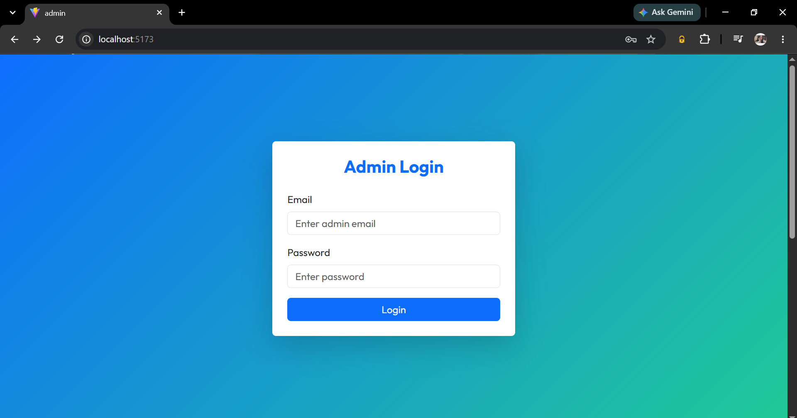
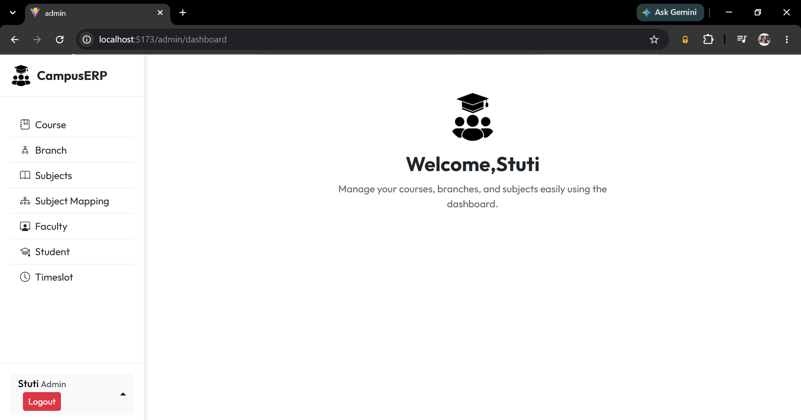
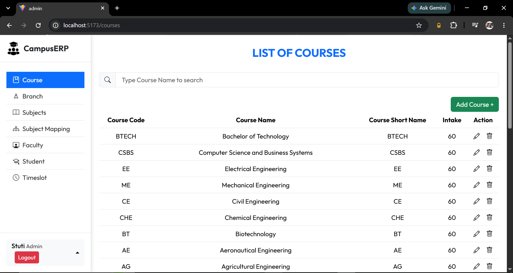

# CampusERP 🎓

CampusERP is a web-based college management system designed to simplify and manage academic and administrative activities through a centralized platform.

## 🚀 Features

- Admin Login & Authentication
- Dashboard for centralized management
- Course Management
- Branch Management
- Subject Management
- Subject Mapping
- Faculty Management
- Student Management
- Timeslot Management
- CRUD Operations
- Student Image Upload using Cloudinary
- MongoDB Database Integration

## 🛠️ Technology Stack

- **Frontend:** React.js, React Bootstrap, Axios
- **Backend:** Node.js, Express.js
- **Database:** MongoDB, Mongoose
- **Cloud Storage:** Cloudinary

## 📸 Screenshots

### Login Page



### Dashboard



### Course List



## ⚙️ Installation & Setup

### 1. Clone the Repository

```bash
git clone https://github.com/stutigupta1503/CampusERP.git
cd CampusERP
````

### 2. Install Frontend Dependencies

```bash
cd admin-erp-main
npm install
```

### 3. Install Backend Dependencies

```bash
cd ../api-erp-main
npm install
```

### 4. Environment Variables

Create a `.env` file inside the backend folder:

```env
CLOUDINARY_CLOUD_NAME=your_cloud_name
CLOUDINARY_API_KEY=your_api_key
CLOUDINARY_API_SECRET=your_api_secret
```

Create a `.env` file inside the frontend folder:

```env
VITE_API_URL=http://localhost:3000
```

### 5. Run the Backend

```bash
node index.js
```

### 6. Run the Frontend

```bash
npm run dev
```

## 📂 Project Structure

```text
CampusERP/
├── admin-erp-main/
│   ├── src/
│   ├── public/
│   └── package.json
│
├── api-erp-main/
│   ├── controllers/
│   ├── models/
│   ├── routes/
│   ├── index.js
│   └── package.json
│
├── .gitignore
└── README.md
```

## 🎯 Purpose

CampusERP provides a centralized platform for managing college academic data and administrative activities, reducing manual work and making data management more organized and efficient.

## 👩‍💻 Developer

**Stuti Gupta**

[GitHub](https://github.com/stutigupta1503) | [LinkedIn](https://www.linkedin.com/in/stuti-gupta1503/)

```
```
